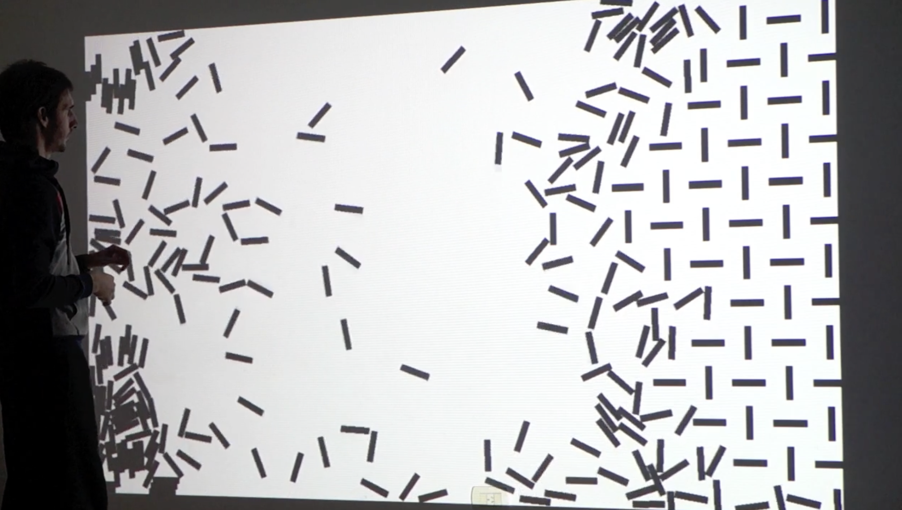
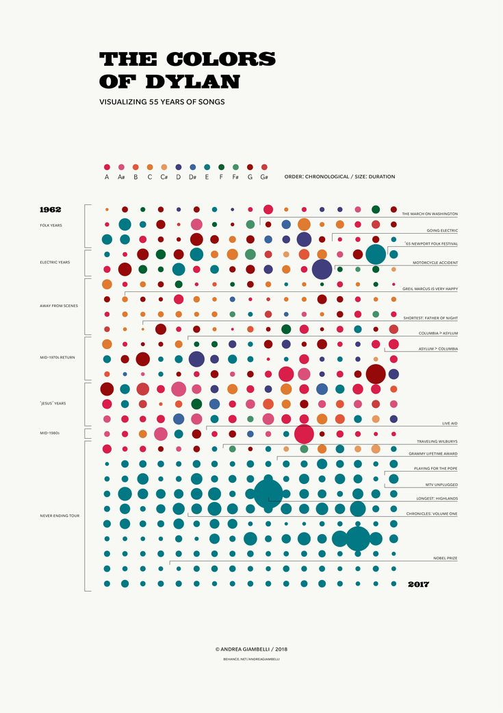
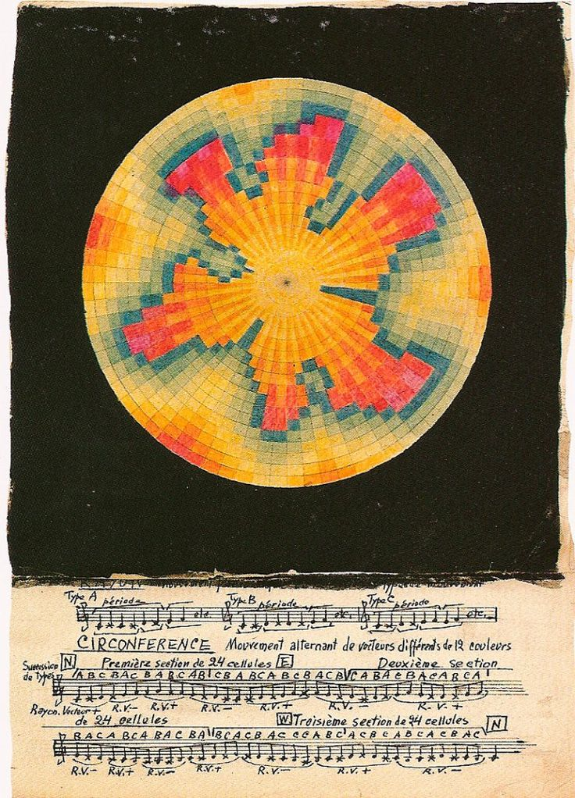
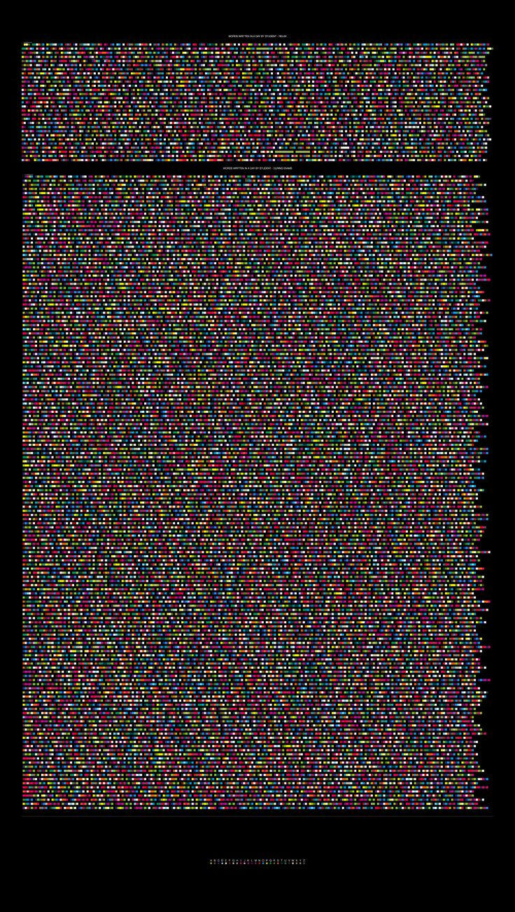

# Final Project

##### Plan A
A customized 3D typeface editor. (might interactive with some physical component)

Reference: 
- <video controls src="kiel danger mutschelknaus | New STG is up and public! STG v.Boost! Get your extrusion on and play with some dimensional typography. Link in bio. Tons of features... | Instagram.mp4" title="Title"></video>
- https://spacetypegenerator.com

##### Plan B
Interactive (ultura-sound sensor based) poster. (e.g express the water usage in AI industry)

- 
- 
- https://player.vimeo.com/video/103780330?title=0&byline=0&portrait=0&autoplay=true&color=cb2027

##### Plan C
Musical visualization along with controllable node. (explore more "forms" besides "waves")

- 
- 
- 

--------------------------------------------------------------------------
