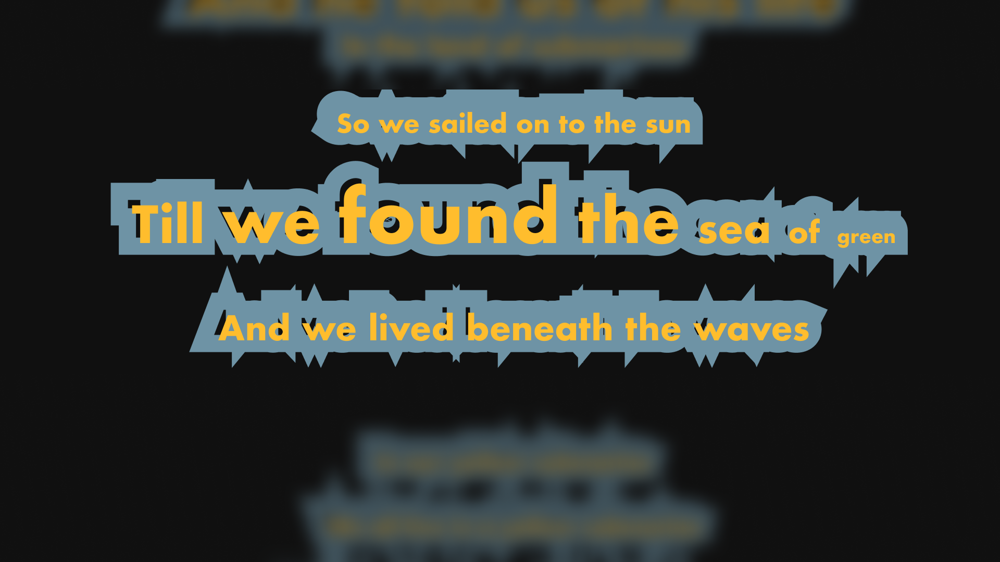

# Final Project

##### Plan A
A customized 3D typeface editor. (might interactive with some physical component)

optional: Add physical control components, such as knobs, sliders, or force resistors, to connect to the Arduino. Users can change font parameters through these physical controls.

Reference: 
- 3D Type
- https://www.instagram.com/p/DCmy7IVSIcA/?img_index=1
- 3D Type Generator
- https://spacetypegenerator.com


##### Plan B
Interactive (ultura-sound sensor based) poster. (e.g express the water usage in AI industry)

Based on sensor data, render dynamic visual effects on the screen or projection. E.g when a viewer approaches, more detailed information is displayed or visual changes are triggered. (infos that are hidden gradually revealed)

- Motion Capture
- 
- Interactive Shape 1
- 
- Interactive Shape 2
- https://player.vimeo.com/video/103780330?title=0&byline=0&portrait=0&autoplay=true&color=cb2027

##### Plan C
Musical visualization along with controllable node. (explore more "forms" besides "waves")

- Viualization 1
- 
- Viualization 2
- 
- Viualization 3
- 


--------------------------------------------------------------------------

## Week II

## Intro

Visual Experimentation - I aim to combine both type and sound together to create a artistic-looking Musical teleprompter.

## **Technical Plan**

### **Arduino:**

- Read input from multiple potentiometer to control different areas of the sound

### Javascript

- receives data from arduino?
- load and play music
- analyze audio in real-time
- synchronize lyrics display along with correct timing of the music
- visual effects (might reference to 3d type)
- 

### **Potential Data/ Libraries/ Components**

Data

- mp3/ WAV
- LRC (lyrics)

Libraries:

- p5.js
- p5.sound
- Tone.js (might)

Components:

- potentiometers

### **There will be several difficulties:**

- match the specific lyrics with time
- apply visual effects based on the real-time music
- (might) implement feature that allow user to upload their own song and lyrics

### Some Codes:

```jsx
//pre-set
function preload() {
  song = loadSound();
  lyrics = loadJSON(); 
}

function setup(){
	createCanvas(windowWidth, windowHeight);

	//connect to arduino
	//serial port - new p5.SerialPort();
	get data from arduino
	
	//sound analysis();
	song.play();
}

function draw() {
  background(0);
  
  // current time
  let currentTime = song.currentTime();
  
  // Update current lyric based on time
  
  // Display current lyric
  // + visual effect
  // could reference to https://spacetypegenerator.com
  
  // add visual effects based on audio
   
  //get data from arduino? -  change based on amplitude & loudness
  // Adjust visuals based on sensor data
}

```

Visual Explore
 